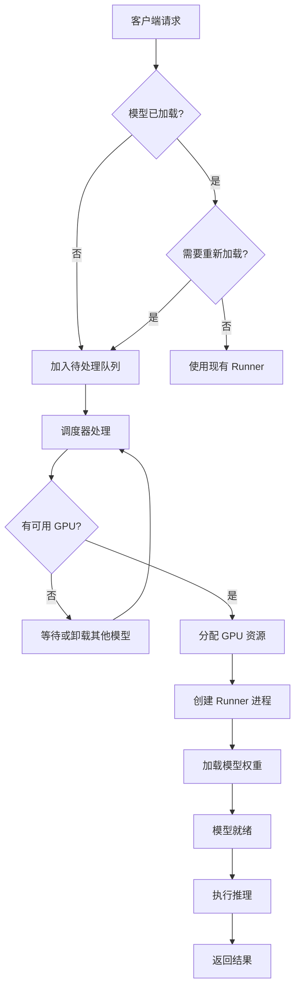
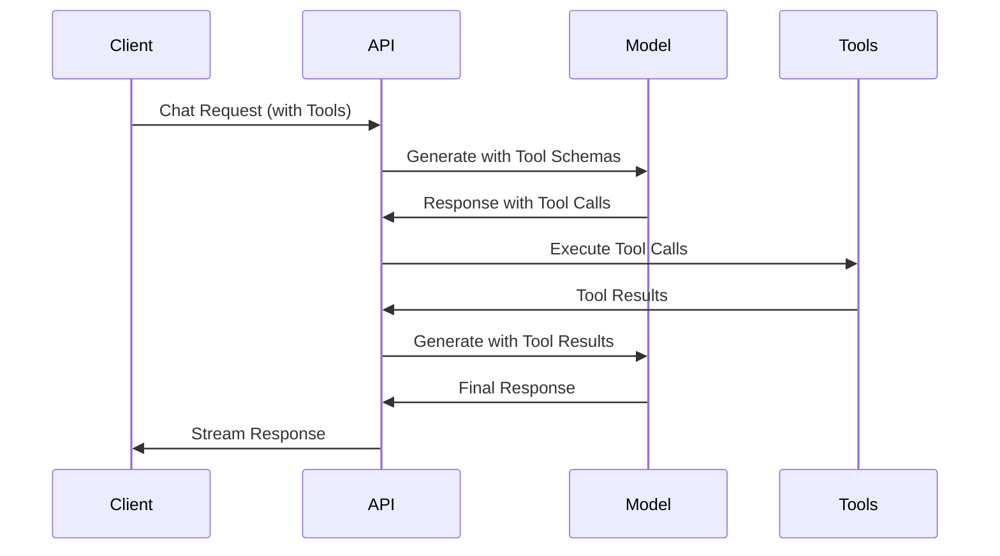

# Ollama 核心工作流程分析

本文档深入分析 Ollama 的核心架构和工作流程，帮助理解这个本地大模型运行引擎的设计原理。

## 目录

1. [系统架构概览](#系统架构概览)
2. [启动流程](#启动流程)
3. [模型管理](#模型管理)
4. [调度器架构](#调度器架构)
5. [推理引擎](#推理引擎)
6. [API 层](#api-层)
7. [工具调用机制](#工具调用机制)

## 系统架构概览

Ollama 是一个本地大模型运行引擎，采用分层架构设计：

```text
┌─────────────────────────────────────────┐
│         HTTP API Layer                  │
│      (server/routes.go)                 │
└──────────────┬──────────────────────────┘
               │
┌──────────────▼──────────────────────────┐
│         Scheduler                       │
│      (server/sched.go)                  │
│  - 模型生命周期管理                      │
│  - 内存分配策略                         │
│  - 多模型并发控制                       │
└──────────────┬──────────────────────────┘
               │
┌──────────────▼──────────────────────────┐
│      LLM Server Abstraction             │
│      (llm/server.go)                    │
│  - Runner 进程管理                      │
│  - 模型加载协调                         │
└──────────────┬──────────────────────────┘
               │
       ┌───────┴───────┐
       │               │
┌──────▼──────┐  ┌─────▼──────┐
│ Ollama     │  │ Llama      │
│ Runner     │  │ Runner     │
│ (新引擎)   │  │ (旧引擎)    │
└──────┬─────┘  └─────┬───────┘
       │              │
┌──────▼─────────────▼──────┐
│    Model Backend          │
│  (ml/backend/ggml)        │
│  - llama.cpp 集成         │
│  - GPU/CPU 计算           │
└───────────────────────────┘
```

### 核心组件

1. **HTTP API 层**：处理客户端请求，提供 RESTful API
2. **调度器**：管理模型加载、卸载和资源分配
3. **LLM 服务器**：抽象层，管理 runner 进程
4. **推理引擎**：执行实际的模型推理（两个实现：ollamarunner 和 llamarunner）
5. **模型后端**：底层计算引擎（基于 llama.cpp）

## 启动流程

### 入口点

Ollama 的启动从 `main.go` 开始：

```go
// ollama/main.go
func main() {
    cobra.CheckErr(cmd.NewCLI().ExecuteContext(context.Background()))
}
```

### 启动链路

```text
main.go
  └─> cmd.NewCLI()
      └─> cmd/start.go (平台特定启动)
          └─> app/server/server.go
              └─> server/routes.go::Serve()
                  └─> 初始化 HTTP 服务器
                  └─> 初始化调度器 (InitScheduler)
                  └─> 启动调度器 (sched.Run())
```

### 关键启动代码

**server/routes.go::Serve()** 是核心启动函数：

```go
func Serve(ln net.Listener) error {
    // 1. 初始化日志
    slog.SetDefault(logutil.NewLogger(os.Stderr, envconfig.LogLevel()))
    
    // 2. 初始化 blob 存储
    blobsDir, err := GetBlobsPath("")
    
    // 3. 清理未使用的层和清单
    if !envconfig.NoPrune() {
        PruneLayers()
        PruneDirectory(manifestsPath)
    }
    
    // 4. 创建服务器实例
    s := &Server{addr: ln.Addr()}
    
    // 5. 生成路由
    h, err := s.GenerateRoutes(rc)
    http.Handle("/", h)
    
    // 6. 初始化调度器
    ctx, done := context.WithCancel(context.Background())
    schedCtx, schedDone := context.WithCancel(ctx)
    sched := InitScheduler(schedCtx)
    s.sched = sched
    
    // 7. 启动 HTTP 服务器
    srvr := &http.Server{Handler: nil}
    
    // 8. 启动调度器
    s.sched.Run(schedCtx)
    
    return srvr.Serve(ln)
}
```

## 模型管理

### 模型存储结构

Ollama 使用分层存储模型：

```text
~/.ollama/
├── history                 # 操作历史
├── id_ed25519              # 私钥(如有用到)
├── id_ed25519.pub          # 公钥
├── logs/                   # 日志目录
└── models/                 # 模型元数据
    └── manifests/
        ├── blobs/          # 模型层（GGUF 文件）
        |   └── sha256:xxx
        └── registry.ollama.ai/...
```

### 模型格式：GGUF

GGUF (GPT-Generated Unified Format) 是 Ollama 使用的二进制模型格式。

#### GGUF 文件结构

```text
┌─────────────────┐
│  Magic Number   │  "GGUF" (4 bytes)
├─────────────────┤
│  Version        │  uint32
├─────────────────┤
│  Num Tensors    │  uint64
├─────────────────┤
│  Num KV Pairs   │  uint64
├─────────────────┤
│  KV Pairs       │  Key-Value 元数据
│  - general.*    │  通用配置
│  - tokenizer.*  │  Tokenizer 配置
│  - *.layers.*   │  层配置
├─────────────────┤
│  Tensors        │  张量定义
│  - 名称         │
│  - 维度         │
│  - 数据类型     │
│  - 数据偏移     │
├─────────────────┤
│  Tensor Data    │  实际权重数据
│  (对齐存储)     │
└─────────────────┘
```

#### GGUF 解析流程

**fs/ggml/gguf.go** 负责解析 GGUF 文件：

```go
func (c *containerGGUF) Decode(rs io.ReadSeeker) (model, error) {
    // 1. 读取版本号
    if err := binary.Read(rs, c.ByteOrder, &c.Version); err != nil {
        return nil, err
    }
    
    // 2. 读取张量和 KV 对数量
    switch c.Version {
    case 1:
        err = binary.Read(rs, c.ByteOrder, &c.V1)
    case 2:
        err = binary.Read(rs, c.ByteOrder, &c.V2)
    default:
        err = binary.Read(rs, c.ByteOrder, &c.V3)
    }
    
    // 3. 创建 GGUF 模型实例
    model := newGGUF(c)
    
    // 4. 解码 KV 对和张量
    if err := model.Decode(rs); err != nil {
        return nil, err
    }
    
    return model, nil
}
```

### 模型注册和发现

**server/model.go** 处理模型发现：

```go
func parseFromModel(ctx context.Context, name model.Name, fn func(api.ProgressResponse)) (layers []*layerGGML, err error) {
    // 1. 解析模型清单
    m, err := ParseNamedManifest(name)
    
    // 2. 如果模型不存在，先拉取
    if errors.Is(err, os.ErrNotExist) {
        if err := PullModel(ctx, name.String(), &registryOptions{}, fn); err != nil {
            return nil, err
        }
        m, err = ParseNamedManifest(name)
    }
    
    // 3. 加载每一层
    for _, layer := range m.Layers {
        switch layer.MediaType {
        case "application/vnd.ollama.image.model":
            // 加载模型文件（GGUF）
            blob, err := os.Open(blobpath)
            f, err := ggml.Decode(blob, -1)
            layers = append(layers, &layerGGML{layer, f})
        }
    }
    
    return layers, nil
}
```

### 模型转换

Ollama 支持从多种格式转换为 GGUF：

**convert/convert.go** 定义了转换接口：

```go
type ModelConverter interface {
    // KV 映射：将参数映射到 LLM 键值对
    KV(*Tokenizer) ggml.KV
    
    // Tensors 映射：将输入张量映射到 LLM 张量
    Tensors([]Tensor) []*ggml.Tensor
    
    // 替换规则：张量名称替换
    Replacements() []string
}
```

支持的转换：

- PyTorch (Safetensors) → GGUF
- HuggingFace 模型 → GGUF
- 量化转换（Q4_0, Q8_0, F16, F32 等）

## 调度器架构

调度器是 Ollama 的核心组件，负责管理模型生命周期和资源分配。

### 调度器结构

**server/sched.go** 定义了调度器：

```go
type Scheduler struct {
    pendingReqCh  chan *LlmRequest    // 待处理请求队列
    finishedReqCh chan *LlmRequest    // 已完成请求队列
    expiredCh     chan *runnerRef     // 过期 runner 通知
    unloadedCh    chan any            // 卸载通知
    
    loadedMu sync.Mutex               // 保护 loaded 和 activeLoading
    activeLoading llm.LlamaServer     // 正在加载的模型
    loaded        map[string]*runnerRef // 已加载的模型
    
    loadFn          func(...) bool    // 加载函数
    newServerFn     func(...)         // 创建服务器函数
    getGpuFn        func(...)        // 获取 GPU 信息
    getSystemInfoFn func()            // 获取系统信息
}
```

### 调度流程



### 内存管理策略

调度器使用智能内存分配：

1. **GPU 内存分配**：

   ```go
   // 计算可用 GPU 内存
   available := gpu.FreeMemory - envconfig.GpuOverhead() - gpu.MinimumMemory()
   
   // 分配层到 GPU
   gpuLayers := assignLayers(layers, gpus, requireFull, numGPU)
   ```

2. **CPU 回退**：当 GPU 内存不足时，部分层回退到 CPU

3. **模型卸载**：基于 keep-alive 时间自动卸载未使用的模型

### 并发控制

调度器支持多模型并发：

```go
// 使用信号量控制并发数
sem := semaphore.NewWeighted(int64(numParallel))

// 获取信号量
if err := sem.Acquire(ctx, 1); err != nil {
    return err
}
defer sem.Release(1)
```

## 推理引擎

Ollama 有两个推理引擎实现：

1. **ollamarunner**：新的 Go 原生实现（推荐）
2. **llamarunner**：基于 llama.cpp 的旧实现

### Runner 进程架构

Ollama 使用独立的 runner 进程来执行推理：

```text
主进程 (ollama serve)
  └─> 启动 Runner 子进程
      └─> Runner 监听本地端口
      └─> 主进程通过 HTTP 与 Runner 通信
```

**llm/server.go::StartRunner()** 启动 runner：

```go
func StartRunner(ollamaEngine bool, modelPath string, gpuLibs []string, out io.Writer, extraEnvs map[string]string) (cmd *exec.Cmd, port int, err error) {
    // 1. 获取可执行文件路径
    exe, err := os.Executable()
    
    // 2. 分配随机端口
    port = allocateRandomPort()
    
    // 3. 构建命令参数
    params := []string{"runner"}
    if ollamaEngine {
        params = append(params, "--ollama-engine")
    }
    params = append(params, "--model", modelPath)
    params = append(params, "--port", strconv.Itoa(port))
    
    // 4. 设置环境变量（GPU 库路径）
    cmd.Env = os.Environ()
    cmd.Env = append(cmd.Env, setLibraryPath(gpuLibs)...)
    
    // 5. 启动进程
    cmd = exec.Command(exe, params...)
    return cmd, port, nil
}
```

### 模型加载流程

**runner/ollamarunner/runner.go::allocModel()** 分配模型内存：

```go
func (s *Server) allocModel(
    mpath string,
    params ml.BackendParams,
    loraPath []string,
    parallel int,
    kvCacheType string,
    kvSize int,
    multiUserCache bool,
) (panicErr error) {
    // 1. 创建模型实例
    s.model, err = model.New(mpath, params)
    
    // 2. 创建 KV Cache
    s.cache, err = NewInputCache(s.model, kvCacheType, int32(kvSize), parallel, s.batchSize, multiUserCache)
    
    // 3. 初始化序列槽
    s.parallel = parallel
    s.seqs = make([]*Sequence, s.parallel)
    s.seqsSem = semaphore.NewWeighted(int64(s.parallel))
    
    // 4. 预留最坏情况图内存
    err = s.reserveWorstCaseGraph(true)
    return s.reserveWorstCaseGraph(false)
}
```

**loadModel()** 加载模型权重：

```go
func (s *Server) loadModel() {
    err := s.model.Backend().Load(context.TODO(),
        func(progress float32) {
            s.progress = progress
        })
    if err != nil {
        panic(fmt.Errorf("failed to load model: %v", err))
    }
    
    s.status = llm.ServerStatusReady
    s.ready.Done()
}
```

### 推理执行流程

**runner/ollamarunner/runner.go::completion()** 处理推理请求：

```go
func (s *Server) completion(w http.ResponseWriter, r *http.Request) {
    // 1. 解析请求
    var req llm.CompletionRequest
    json.NewDecoder(r.Body).Decode(&req)
    
    // 2. 创建采样器
    sampler := sample.NewSampler(
        req.Options.Temperature,
        req.Options.TopK,
        req.Options.TopP,
        ...
    )
    
    // 3. 创建序列
    seq, err := s.NewSequence(req.Prompt, req.Images, NewSequenceParams{
        numPredict:  req.Options.NumPredict,
        stop:        req.Options.Stop,
        sampler:     sampler,
        ...
    })
    
    // 4. 获取序列槽
    if err := s.seqsSem.Acquire(r.Context(), 1); err != nil {
        return
    }
    defer s.seqsSem.Release(1)
    
    // 5. 执行推理循环
    go seq.Run()
    
    // 6. 流式返回结果
    for {
        select {
        case resp := <-seq.responses:
            // 发送响应
            json.NewEncoder(w).Encode(resp)
            flusher.Flush()
        case <-seq.quit:
            return
        }
    }
}
```

### 前向传播

**Sequence.Run()** 执行推理循环：

```go
func (seq *Sequence) Run() {
    for {
        // 1. 准备批次
        batch := seq.prepareBatch()
        
        // 2. 执行前向传播
        logits, err := model.Forward(ctx, seq.model, batch)
        
        // 3. 采样下一个 token
        token, logprobs := seq.sampler.Sample(logits)
        
        // 4. 解码 token
        text := seq.model.Decode(token)
        
        // 5. 检查停止条件
        if seq.shouldStop(text) {
            break
        }
        
        // 6. 发送响应
        seq.responses <- response{content: text, logprobs: logprobs}
    }
}
```

## API 层

### 路由定义

**server/routes.go::GenerateRoutes()** 定义所有 API 路由：

```go
func (s *Server) GenerateRoutes(rc *ollama.Registry) (*gin.Engine, error) {
    r := gin.New()
    
    // 中间件
    r.Use(gin.Recovery())
    r.Use(middleware.Logger())
    
    // API 路由
    r.POST("/api/generate", s.GenerateHandler)
    r.POST("/api/chat", s.ChatHandler)
    r.POST("/api/embeddings", s.EmbeddingsHandler)
    r.POST("/api/pull", s.PullHandler)
    r.POST("/api/push", s.PushHandler)
    r.DELETE("/api/delete", s.DeleteHandler)
    r.GET("/api/tags", s.TagsHandler)
    r.GET("/api/show", s.ShowHandler)
    
    return r, nil
}
```

### 生成请求处理

**GenerateHandler** 处理生成请求：

```go
func (s *Server) GenerateHandler(c *gin.Context) {
    // 1. 解析请求
    var req api.GenerateRequest
    c.ShouldBindJSON(&req)
    
    // 2. 验证模型名称
    name := model.ParseName(req.Model)
    
    // 3. 调度 runner
    r, m, opts, err := s.scheduleRunner(c.Request.Context(), name.String(), caps, req.Options, req.KeepAlive)
    
    // 4. 处理 prompt 模板
    if !req.Raw {
        prompt = m.Template.Render(values)
    }
    
    // 5. 调用推理
    ch := make(chan any)
    go func() {
        defer close(ch)
        r.Completion(c.Request.Context(), llm.CompletionRequest{
            Prompt:  prompt,
            Images:  images,
            Options: opts,
            ...
        }, func(cr llm.CompletionResponse) {
            // 流式返回结果
            ch <- api.GenerateResponse{
                Model:    req.Model,
                Response: cr.Content,
                Done:     cr.Done,
                ...
            }
        })
    }()
    
    // 6. 流式响应
    c.Stream(func(w io.Writer) bool {
        if msg, ok := <-ch; ok {
            c.SSEvent("", msg)
            return true
        }
        return false
    })
}
```

### 聊天请求处理

**ChatHandler** 处理多轮对话：

```go
func (s *Server) ChatHandler(c *gin.Context) {
    var req api.ChatRequest
    c.ShouldBindJSON(&req)
    
    // 1. 调度 runner
    r, m, opts, err := s.scheduleRunner(...)
    
    // 2. 渲染消息模板
    prompt := m.Template.RenderChat(req.Messages)
    
    // 3. 处理工具调用
    if len(req.Tools) > 0 {
        // 注册工具
        // 执行工具调用循环
    }
    
    // 4. 执行推理
    r.Completion(...)
}
```

## 工具调用机制

Ollama 支持函数调用（Function Calling），允许模型调用外部工具。

### 工具注册

**x/tools/registry.go** 定义工具注册表：

```go
type Registry struct {
    tools map[string]Tool
}

type Tool interface {
    Name() string
    Description() string
    Schema() api.ToolFunction
    Execute(args map[string]any) (string, error)
}
```

### 工具调用流程



### 工具执行

**x/cmd/run.go** 中的工具执行逻辑：

```go
// 执行工具调用
for _, call := range pendingToolCalls {
    toolName := call.Function.Name
    args := call.Function.Arguments.ToMap()
    
    // 检查权限（bash 命令需要批准）
    if toolName == "bash" {
        if denied, pattern := agent.IsDenied(cmd); denied {
            // 拒绝执行
            continue
        }
        if !approval.IsAllowed(toolName, args) {
            // 请求用户批准
            result := approval.RequestApproval(toolName, args)
            if result.Decision == agent.ApprovalDeny {
                continue
            }
        }
    }
    
    // 执行工具
    toolResult, err := toolRegistry.Execute(call)
    
    // 添加到消息历史
    toolResults = append(toolResults, api.Message{
        Role:       "tool",
        Content:    toolResult,
        ToolCallID: call.ID,
    })
}
```

## 关键技术点

### 1. CGO 集成

Ollama 通过 CGO 调用 llama.cpp：

```go
// #cgo CFLAGS: ...
// #cgo LDFLAGS: ...
import "C"

// 调用 C 函数
result := C.llama_model_load(...)
```

### 2. 内存管理

- **GPU 内存**：通过 CUDA/ROCm 分配
- **CPU 内存**：使用 mmap 优化大模型加载
- **KV Cache**：预分配缓存空间

### 3. 并发推理

- 使用信号量控制并发数
- 每个序列独立处理
- 共享模型权重，独立 KV Cache

### 4. 流式响应

- 使用 Server-Sent Events (SSE)
- 每个 token 立即返回
- 支持客户端取消

## 总结

Ollama 的核心设计理念：

1. **进程隔离**：Runner 进程独立运行，避免崩溃影响主进程
2. **资源管理**：智能调度器管理 GPU/CPU 资源
3. **模型格式**：GGUF 格式优化存储和加载
4. **API 设计**：RESTful API + 流式响应
5. **可扩展性**：支持多模型、多 GPU、工具调用

这种架构使得 Ollama 能够在本地高效运行大模型，同时保持简单易用的 API 接口。
