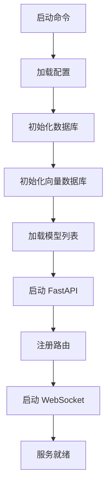
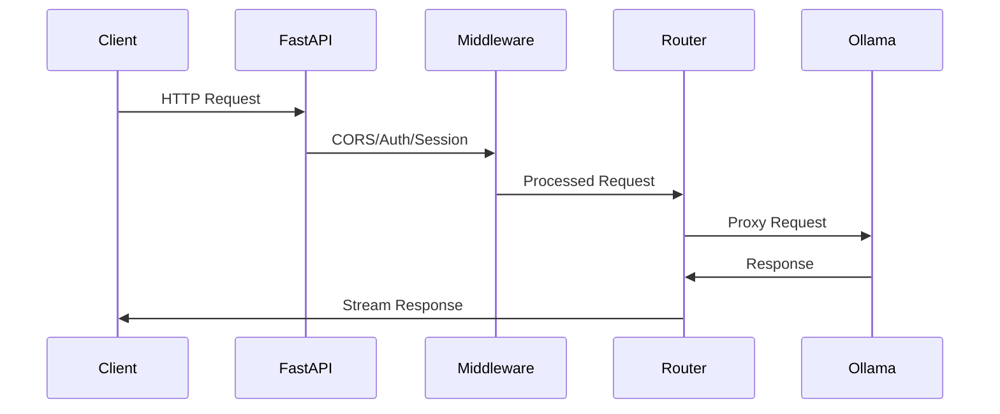
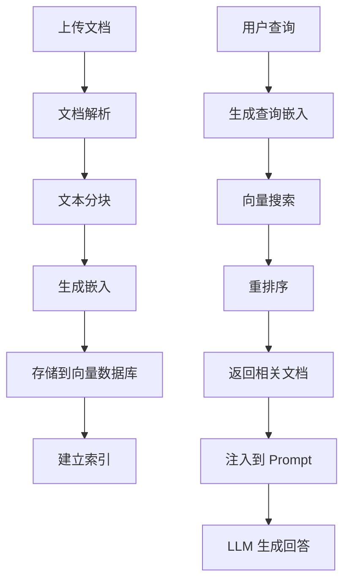
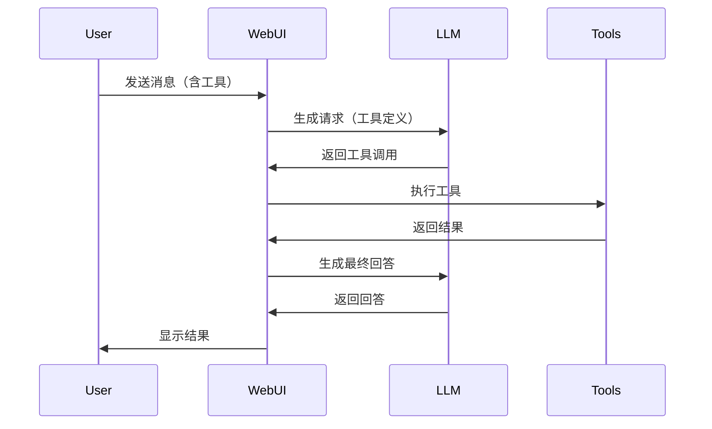

# Open WebUI 核心工作流程分析

本文档深入分析 Open WebUI 的核心架构和工作流程，帮助理解这个 AI 平台的设计原理。

## 目录

1. [系统架构概览](#系统架构概览)
2. [启动流程](#启动流程)
3. [前端架构](#前端架构)
4. [后端架构](#后端架构)
5. [Ollama 集成](#ollama-集成)
6. [RAG 功能](#rag-功能)
7. [工具集成](#工具集成)
8. [WebSocket 实时通信](#websocket-实时通信)

## 系统架构概览

Open WebUI 是一个全栈 AI 平台，采用前后端分离架构：

```
┌─────────────────────────────────────────┐
│         Frontend (Svelte)               │
│      (src/lib/components/)              │
│  - Chat Interface                       │
│  - Model Management                     │
│  - Knowledge Base UI                     │
└──────────────┬──────────────────────────┘
               │ HTTP/WebSocket
┌──────────────▼──────────────────────────┐
│      FastAPI Backend                    │
│      (backend/open_webui/)              │
│  - API Routes                           │
│  - Authentication                       │
│  - Business Logic                       │
└──────────────┬──────────────────────────┘
               │
       ┌───────┴───────┐
       │               │
┌──────▼──────┐  ┌─────▼──────┐
│  Ollama    │  │  Vector DB  │
│  API       │  │  (RAG)      │
└────────────┘  └─────────────┘
```

### 核心组件

1. **前端 (Svelte)**：用户界面，基于 SvelteKit
2. **后端 (FastAPI)**：Python 异步 Web 框架
3. **数据库**：SQLite/PostgreSQL 存储用户数据
4. **向量数据库**：支持多种向量数据库（Chroma, Qdrant, Milvus 等）
5. **Ollama 集成**：代理 Ollama API 请求

## 启动流程

### 入口点

Open WebUI 的启动从 `backend/open_webui/__init__.py` 开始：

```python
@app.command()
def serve(
    host: str = "0.0.0.0",
    port: int = 8080,
):
    # 1. 设置环境变量
    os.environ["FROM_INIT_PY"] = "true"
    
    # 2. 加载或生成密钥
    if os.getenv("WEBUI_SECRET_KEY") is None:
        if not KEY_FILE.exists():
            KEY_FILE.write_bytes(base64.b64encode(random.randbytes(12)))
        os.environ["WEBUI_SECRET_KEY"] = KEY_FILE.read_text()
    
    # 3. 启动 Uvicorn 服务器
    import open_webui.main
    uvicorn.run(
        "open_webui.main:app",
        host=host,
        port=port,
        forwarded_allow_ips="*",
        workers=UVICORN_WORKERS,
    )
```

### 应用初始化

**backend/open_webui/main.py** 初始化 FastAPI 应用：

```python
app = FastAPI(
    title="Open WebUI API",
    description="Open WebUI API for OpenAI-compatible chat completions",
    version=VERSION,
)

# 1. 中间件配置
app.add_middleware(CORSMiddleware, ...)
app.add_middleware(SessionMiddleware, ...)
app.add_middleware(AuditLoggingMiddleware, ...)

# 2. 静态文件服务
app.mount("/static", StaticFiles(directory=STATIC_DIR), name="static")

# 3. WebSocket 支持
app.mount("/ws", socket_app)

# 4. 路由注册
app.include_router(ollama.router, prefix="/ollama", tags=["ollama"])
app.include_router(openai.router, prefix="/openai", tags=["openai"])
app.include_router(chats.router, prefix="/api/v1/chats", tags=["chats"])
app.include_router(retrieval.router, prefix="/api/v1/retrieval", tags=["retrieval"])
# ... 更多路由
```

### 启动流程



## 前端架构

### Svelte 应用结构

Open WebUI 前端使用 SvelteKit 构建：

```
src/
├── lib/
│   ├── components/        # UI 组件
│   │   └── chat/         # 聊天组件
│   ├── apis/             # API 客户端
│   │   └── ollama/       # Ollama API
│   └── stores/           # 状态管理
├── routes/               # 页面路由
└── app.html              # HTML 模板
```

### 聊天界面

**src/lib/components/chat/Chat.svelte** 是核心聊天组件：

```typescript
// 发送消息
async function sendMessage() {
    const res = await generateOpenAIChatCompletion(
        localStorage.token,
        {
            stream: stream,
            model: model.id,
            messages: messages,
            params: {...settings?.params, ...params},
            files: files,
            tool_ids: toolIds,
            tool_servers: toolServers,
            // ...
        },
        `${WEBUI_BASE_URL}/api`
    );
    
    // 处理流式响应
    if (stream) {
        for await (const chunk of res) {
            // 更新 UI
            updateMessage(chunk);
        }
    }
}
```

### API 客户端

**src/lib/apis/ollama/index.ts** 封装 Ollama API：

```typescript
export const generateChatCompletion = async (
    token: string = '',
    body: object
) => {
    const res = await fetch(`${OLLAMA_API_BASE_URL}/api/chat`, {
        method: 'POST',
        headers: {
            'Content-Type': 'application/json',
            Authorization: `Bearer ${token}`
        },
        body: JSON.stringify(body)
    });
    
    return res;
};
```

## 后端架构

### 路由组织

后端采用模块化路由设计：

```python
# backend/open_webui/routers/
├── ollama.py          # Ollama API 代理
├── openai.py          # OpenAI 兼容 API
├── chats.py           # 聊天管理
├── retrieval.py       # RAG 功能
├── knowledge.py       # 知识库管理
├── tools.py           # 工具管理
└── ...
```

### 请求处理流程



### 认证和授权

**backend/open_webui/utils/auth.py** 处理认证：

```python
async def get_verified_user(
    token: str = Depends(get_token),
    db: Session = Depends(get_db),
) -> UserModel:
    """验证用户 token 并返回用户对象"""
    try:
        payload = decode_token(token)
        user_id = payload.get("id")
        user = Users.get_user_by_id(db, user_id)
        if not user:
            raise HTTPException(status_code=401, detail="Invalid authentication")
        return user
    except Exception as e:
        raise HTTPException(status_code=401, detail="Invalid authentication")
```

## Ollama 集成

### API 代理

Open WebUI 作为 Ollama 的代理层，提供统一的 API 接口。

**backend/open_webui/routers/ollama.py** 实现代理：

```python
@router.post("/api/chat")
@router.post("/api/chat/{url_idx}")
async def chat_completion(
    request: Request,
    form_data: ChatCompletionForm,
    url_idx: Optional[int] = None,
    user=Depends(get_verified_user),
):
    # 1. 获取模型列表
    if url_idx is None:
        await get_all_models(request, user=user)
        models = request.app.state.OLLAMA_MODELS
        model = form_data.model
        
        # 2. 选择后端 URL
        if model in models:
            url_idx = random.choice(models[model]["urls"])
        else:
            raise HTTPException(status_code=400, detail="Model not found")
    
    # 3. 获取配置
    url = request.app.state.config.OLLAMA_BASE_URLS[url_idx]
    api_config = request.app.state.config.OLLAMA_API_CONFIGS.get(str(url_idx), {})
    
    # 4. 处理前缀
    prefix_id = api_config.get("prefix_id", None)
    if prefix_id:
        form_data.model = form_data.model.replace(f"{prefix_id}.", "")
    
    # 5. 转发请求
    return await send_post_request(
        url=f"{url}/api/chat",
        payload=form_data.model_dump_json(exclude_none=True).encode(),
        key=get_api_key(url_idx, url, request.app.state.config.OLLAMA_API_CONFIGS),
        user=user,
    )
```

### 请求转换

**backend/open_webui/utils/chat.py** 处理格式转换：

```python
async def generate_chat_completion(
    request: Request,
    form_data: dict,
    user: Any,
    bypass_filter: bool = False,
):
    # 1. 获取模型信息
    models = await get_all_models(request, user=user)
    model = models.get(form_data.get("model"))
    
    # 2. 判断模型类型
    if model.get("owned_by") == "ollama":
        # 转换为 Ollama 格式
        form_data = convert_payload_openai_to_ollama(form_data)
        response = await generate_ollama_chat_completion(
            request=request,
            form_data=form_data,
            user=user,
            bypass_filter=bypass_filter,
        )
        
        # 3. 转换响应格式
        if form_data.get("stream"):
            return StreamingResponse(
                convert_streaming_response_ollama_to_openai(response),
                headers=dict(response.headers),
            )
        else:
            return convert_response_ollama_to_openai(response)
    else:
        # OpenAI 兼容 API
        return await generate_openai_chat_completion(...)
```

### 流式响应处理

```python
async def send_post_request(
    url: str,
    payload: Union[str, bytes],
    stream: bool = True,
    ...
):
    session = aiohttp.ClientSession(timeout=...)
    
    r = await session.post(url, data=payload, headers=headers)
    
    if stream:
        # 流式响应
        return StreamingResponse(
            r.content,  # 异步迭代器
            status_code=r.status,
            headers=response_headers,
            background=BackgroundTask(cleanup_response, response=r, session=session),
        )
    else:
        # 非流式响应
        res = await r.json()
        return res
```

## RAG 功能

### 向量数据库集成

Open WebUI 支持多种向量数据库：

**backend/open_webui/retrieval/vector/factory.py** 工厂模式：

```python
class Vector:
    @staticmethod
    def get_vector(vector_type: str) -> VectorDBBase:
        """根据类型获取向量数据库实例"""
        match vector_type:
            case VectorType.CHROMA:
                return ChromaClient()
            case VectorType.QDRANT:
                return QdrantClient()
            case VectorType.MILVUS:
                return MilvusClient()
            case VectorType.PGVECTOR:
                return PgvectorClient()
            # ... 更多支持
```

### 文档检索流程

**backend/open_webui/routers/retrieval.py** 实现 RAG：

```python
@router.post("/query/doc")
async def query_doc_handler(
    request: Request,
    form_data: QueryDocForm,
    user=Depends(get_verified_user),
):
    # 1. 获取集合信息
    collection_results = VECTOR_DB_CLIENT.get(
        collection_name=form_data.collection_name
    )
    
    # 2. 混合搜索（如果启用）
    if request.app.state.config.ENABLE_RAG_HYBRID_SEARCH:
        return await query_doc_with_hybrid_search(
            collection_name=form_data.collection_name,
            collection_result=collection_results,
            query=form_data.query,
            embedding_function=lambda query, prefix: request.app.state.EMBEDDING_FUNCTION(
                query, prefix=prefix, user=user
            ),
            k=form_data.k,
            reranking_function=request.app.state.RERANKING_FUNCTION,
            ...
        )
    else:
        # 3. 纯向量搜索
        query_embedding = await request.app.state.EMBEDDING_FUNCTION(
            form_data.query, prefix=RAG_EMBEDDING_QUERY_PREFIX, user=user
        )
        
        result = VECTOR_DB_CLIENT.search(
            collection_name=form_data.collection_name,
            vectors=[query_embedding],
            limit=form_data.k,
        )
        
        return result
```

### 文档处理流程



### 嵌入函数

**backend/open_webui/retrieval/utils.py** 定义嵌入函数：

```python
def get_embedding_function():
    """获取嵌入函数"""
    embedding_engine = os.getenv("RAG_EMBEDDING_ENGINE", "ollama")
    
    if embedding_engine == "ollama":
        return ollama_embedding_function
    elif embedding_engine == "openai":
        return openai_embedding_function
    # ... 更多引擎
```

## 工具集成

### 函数调用

Open WebUI 支持 Python 函数调用：

**backend/open_webui/routers/functions.py** 管理函数：

```python
@router.post("/execute")
async def execute_function(
    request: Request,
    form_data: ExecuteFunctionForm,
    user=Depends(get_verified_user),
):
    # 1. 获取函数定义
    function = Functions.get_function_by_id(db, form_data.function_id)
    
    # 2. 执行函数
    result = execute_python_function(
        code=function.code,
        arguments=form_data.arguments,
    )
    
    return {"result": result}
```

### MCP 服务器集成

Open WebUI 支持 Model Context Protocol (MCP) 服务器：

```python
# MCP 工具注册
if tool_servers:
    for server in tool_servers:
        # 连接到 MCP 服务器
        mcp_client = MCPClient(server.url)
        
        # 获取可用工具
        tools = await mcp_client.list_tools()
        
        # 注册工具
        registered_tools.extend(tools)
```

### 工具调用流程



## WebSocket 实时通信

### Socket.IO 集成

**backend/open_webui/socket/main.py** 实现 WebSocket：

```python
# 初始化 Socket.IO 服务器
if WEBSOCKET_MANAGER == "redis":
    # 使用 Redis 管理多实例
    mgr = socketio.AsyncRedisManager(WEBSOCKET_REDIS_URL)
    sio = socketio.AsyncServer(
        cors_allowed_origins=SOCKETIO_CORS_ORIGINS,
        async_mode="asgi",
        client_manager=mgr,
    )
else:
    # 单实例模式
    sio = socketio.AsyncServer(
        cors_allowed_origins=SOCKETIO_CORS_ORIGINS,
        async_mode="asgi",
    )

# 连接事件
@sio.on("connect")
async def connect(sid, environ, auth):
    """处理客户端连接"""
    token = auth.get("token") if auth else None
    user = await get_user_from_token(token)
    
    # 加入用户房间
    await sio.enter_room(sid, f"user:{user.id}")
    
    return True

# 消息事件
@sio.on("message")
async def handle_message(sid, data):
    """处理实时消息"""
    # 广播到房间
    await sio.emit("response", data, room=f"user:{user.id}")
```

### 实时更新

WebSocket 用于：
- 实时聊天消息
- 模型状态更新
- 文件上传进度
- 系统通知

## 关键技术点

### 1. 异步处理

Open WebUI 大量使用异步编程：

```python
async def process_chat(request, form_data, user):
    # 异步数据库操作
    chat = await Chats.get_chat_by_id(db, chat_id)
    
    # 异步 API 调用
    response = await send_post_request(url, payload)
    
    # 异步向量搜索
    results = await vector_db.search(query)
```

### 2. 多后端支持

支持多个 Ollama 实例：

```python
OLLAMA_BASE_URLS = [
    "http://localhost:11434",
    "http://gpu-server:11434",
]

# 负载均衡
url_idx = random.choice(models[model]["urls"])
```

### 3. 缓存策略

```python
@cached(ttl=MODELS_CACHE_TTL)
async def get_all_models(request, user):
    """缓存模型列表"""
    # 从 Ollama 获取模型
    models = await fetch_models_from_ollama()
    return models
```

### 4. 错误处理

```python
try:
    response = await send_post_request(url, payload)
except HTTPException as e:
    # 处理 HTTP 错误
    raise e
except Exception as e:
    # 处理其他错误
    log.error(f"Error: {e}")
    raise HTTPException(status_code=500, detail=str(e))
```

## 总结

Open WebUI 的核心设计理念：

1. **API 网关**：统一接口，支持多种后端
2. **模块化设计**：清晰的路由和功能分离
3. **异步优先**：充分利用 Python 异步能力
4. **可扩展性**：支持插件、工具、MCP 服务器
5. **用户体验**：实时通信、流式响应、丰富的 UI

这种架构使得 Open WebUI 能够作为强大的 AI 平台，同时保持灵活性和可扩展性。
