# 如何开发自己的 AI 助手

本文档回答关于大模型开发的核心问题，帮助你理解如何构建类似 Ollama 和 Open WebUI 的 AI 系统。

## 目录

1. [大模型文件格式和创建](#大模型文件格式和创建)
2. [模型加载和推理](#模型加载和推理)
3. [Go 语言集成](#go-语言集成)
4. [开发挑战](#开发挑战)
5. [系统差异分析](#系统差异分析)

## 大模型文件格式和创建

### 1. 大模型文件是什么？

大模型文件是经过训练的神经网络权重集合，包含了模型的所有参数。这些参数决定了模型的行为和能力。

#### 模型文件包含的内容

1. **权重（Weights）**：神经网络的参数矩阵
   - 注意力层权重（Attention weights）
   - 前馈网络权重（FFN weights）
   - 嵌入层权重（Embedding weights）
   - 输出层权重（Output weights）

2. **配置信息（Config）**：
   - 模型架构（Architecture）
   - 层数（Layers）
   - 隐藏层维度（Hidden size）
   - 注意力头数（Attention heads）
   - 词汇表大小（Vocab size）

3. **Tokenizer 信息**：
   - 词汇表（Vocabulary）
   - 特殊 token（Special tokens）
   - 合并规则（Merge rules）

4. **元数据（Metadata）**：
   - 模型名称、描述
   - 训练信息
   - 量化信息

### 2. GGUF 格式详解

GGUF (GPT-Generated Unified Format) 是 Ollama 使用的二进制格式，由 llama.cpp 项目开发。

#### GGUF 文件结构

```
┌─────────────────────────────────────┐
│  Magic: "GGUF" (4 bytes)            │
├─────────────────────────────────────┤
│  Version: uint32                    │
├─────────────────────────────────────┤
│  Num Tensors: uint64                │
├─────────────────────────────────────┤
│  Num KV Pairs: uint64               │
├─────────────────────────────────────┤
│  Key-Value Pairs                    │
│  ┌───────────────────────────────┐ │
│  │ Key: string (length + data)    │ │
│  │ Value Type: uint32              │ │
│  │ Value: (根据类型)               │ │
│  └───────────────────────────────┘ │
│  ...                                │
├─────────────────────────────────────┤
│  Tensors                             │
│  ┌───────────────────────────────┐ │
│  │ Name: string                   │ │
│  │ Dimensions: uint32             │ │
│  │ Shape: int64[]                 │ │
│  │ Type: uint32 (ggml_type)        │ │
│  │ Offset: uint64                 │ │
│  └───────────────────────────────┘ │
│  ...                                │
├─────────────────────────────────────┤
│  Tensor Data (对齐存储)              │
│  ┌───────────────────────────────┐ │
│  │ Weight data (二进制)           │ │
│  └───────────────────────────────┘ │
└─────────────────────────────────────┘
```

#### 关键元数据字段

```go
// 通用配置
"general.architecture": "llama"           // 模型架构
"general.file_type": uint32               // 文件类型（量化级别）
"general.parameter_count": uint64         // 参数量
"general.quantization_version": uint32    // 量化版本

// Tokenizer 配置
"tokenizer.ggml.model": string            // Tokenizer 类型
"tokenizer.ggml.tokens": []string         // 词汇表
"tokenizer.ggml.scores": []float32        // Token 分数
"tokenizer.ggml.merges": []string         // BPE 合并规则

// 模型配置
"llama.block_count": uint32               // Transformer 块数
"llama.attention.head_count": uint32      // 注意力头数
"llama.attention.head_count_kv": uint32   // KV 头数
"llama.context_length": uint32            // 上下文长度
"llama.embedding_length": uint32          // 嵌入维度
```

### 3. 模型创建流程

#### 从 PyTorch/Safetensors 转换

Ollama 使用 `convert` 包将 HuggingFace 格式转换为 GGUF：

```go
// ollama/convert/convert.go
func ConvertModel(fsys fs.FS, f *os.File) error {
    // 1. 读取配置文件
    bts, err := fs.ReadFile(fsys, "config.json")
    var p ModelParameters
    json.Unmarshal(bts, &p)
    
    // 2. 根据架构选择转换器
    var conv ModelConverter
    switch p.Architectures[0] {
    case "LlamaForCausalLM":
        conv = &llamaModel{}
    case "MistralForCausalLM":
        conv = &mistralModel{}
    // ... 更多架构
    }
    
    // 3. 解析张量
    ts, err := parseTensors(fsys, strings.NewReplacer(conv.Replacements()...))
    
    // 4. 转换并写入
    return writeFile(f, conv.KV(tokenizer), conv.Tensors(ts))
}
```

#### 转换步骤

1. **读取源模型**：
   ```go
   // 支持 Safetensors 和 PyTorch 格式
   tensors, err := parseSafetensors(fsys, matches...)
   // 或
   tensors, err := parseTorch(fsys, matches...)
   ```

2. **映射张量名称**：
   ```go
   // HuggingFace 格式 → GGUF 格式
   // "model.layers.0.self_attn.q_proj.weight" 
   // → "blk.0.attn_q.weight"
   replacer := strings.NewReplacer(conv.Replacements()...)
   ```

3. **转换数据类型**：
   ```go
   // FP32/FP16 → 量化类型（Q4_0, Q8_0 等）
   quantized := ggml.Quantize(targetType, f32Data, shape)
   ```

4. **写入 GGUF**：
   ```go
   fsggml.WriteGGUF(out, kv, tensors)
   ```

#### 使用 Ollama 转换

```bash
# 创建 Modelfile
cat > Modelfile << EOF
FROM /path/to/safetensors/directory
EOF

# 转换并创建模型
ollama create my-model -f Modelfile

# 量化模型
ollama create my-model-q4 -f Modelfile --quantize q4_0
```

### 4. 量化技术

量化是将模型从高精度（FP32/FP16）转换为低精度（INT8/INT4）的过程，以减少内存占用和提高推理速度。

#### 量化级别

| 类型 | 位宽 | 内存减少 | 质量损失 |
| ---- | ---- | -------- | -------- |
| F32  | 32   | 1x       | 无       |
| F16  | 16   | 2x       | 极小     |
| Q8_0 | 8    | 4x       | 小       |
| Q4_0 | 4    | 8x       | 中等     |
| Q4_1 | 4    | 8x       | 中等     |
| Q3_K | 3    | ~10x     | 较大     |
| Q2_K | 2    | ~16x     | 大       |

#### 量化实现

```go
// ollama/ml/backend/ggml/quantization.go
func Quantize(dstType TensorType, src []float32, shape []uint64) []byte {
    switch dstType {
    case TensorTypeQ4_0:
        return quantizeQ4_0(src, shape)
    case TensorTypeQ8_0:
        return quantizeQ8_0(src, shape)
    // ... 更多量化类型
    }
}

// Q4_0 量化：每个权重用 4 位表示
// 使用块量化：每 32 个值共享一个 scale
func quantizeQ4_0(data []float32, shape []uint64) []byte {
    blockSize := 32
    blocks := len(data) / blockSize
    
    result := make([]byte, blocks*(2+blockSize/2)) // scale(2) + qs(16)
    
    for i := 0; i < blocks; i++ {
        block := data[i*blockSize : (i+1)*blockSize]
        
        // 计算 scale
        max := float32(0)
        for _, v := range block {
            if abs(v) > max {
                max = abs(v)
            }
        }
        scale := max / 7.0 // Q4 范围是 -7 到 7
        
        // 量化
        for j, v := range block {
            q := int8(v / scale)
            // 打包到 4 位
            result[offset+j/2] |= byte(q&0xF) << (4 * (j % 2))
        }
    }
    
    return result
}
```

## 模型加载和推理

### 1. 模型加载流程

#### 内存分配策略

Ollama 使用智能内存分配，优先使用 GPU，不足时回退到 CPU：

```go
// ollama/llm/server.go::Load()
func (s *llamaServer) Load(ctx context.Context, systemInfo ml.SystemInfo, 
    systemGPUs []ml.DeviceInfo, requireFull bool) ([]ml.DeviceID, error) {
    
    // 1. 初始化内存结构
    s.mem = &ml.BackendMemory{
        CPU: ml.DeviceMemory{Weights: make([]uint64, layers)},
        GPUs: make([]ml.DeviceMemory, len(gpus)),
    }
    
    // 2. 计算图大小（KV Cache + 计算图）
    kv, graphPartial, graphFull := s.ggml.GraphSize(
        uint64(s.options.NumCtx),
        uint64(batchSize),
        parallel,
        kvCacheType,
        flashAttention,
    )
    
    // 3. 分配层到设备
    gpuLayers := assignLayers(layers, gpus, requireFull, numGPU)
    
    // 4. 加载模型
    resp, err := s.initModel(ctx, s.loadRequest, LoadOperationCommit)
    
    return gpuIDs, s.WaitUntilRunning(ctx)
}
```

#### 层分配算法

```go
// ollama/llm/server.go::assignLayers()
func assignLayers(layers []uint64, gpus []ml.DeviceInfo, 
    requireFull bool, requestedLayers int) ml.GPULayersList {
    
    // 1. 按性能排序 GPU
    sortedGPUs := ml.ByPerformance(gpus)
    
    // 2. 贪心分配
    gpuLayers := greedyFit(layers, sortedGPUs, capacity, requestedLayers)
    
    return gpuLayers
}

// 贪心算法：从后往前分配层（后面的层更重要）
func greedyFit(layers []uint64, gpus []ml.DeviceInfo, 
    capacity float32, requestedLayers int) ml.GPULayersList {
    
    device := len(gpus) - 1
    freeSpace := uint64(float32(gpus[device].FreeMemory) * capacity)
    
    for i := len(layers) - 1; i >= 0; i-- {
        if layers[i] <= freeSpace {
            // 分配到当前 GPU
            gpuLayers[0].Layers = append([]int{i}, gpuLayers[0].Layers...)
            freeSpace -= layers[i]
        } else {
            // 切换到下一个 GPU
            device--
            if device < 0 {
                break // CPU 回退
            }
            freeSpace = uint64(float32(gpus[device].FreeMemory) * capacity)
        }
    }
    
    return gpuLayers
}
```

### 2. 推理执行流程

#### 前向传播

```go
// ollama/model/model.go::Forward()
func Forward(ctx ml.Context, m Model, batch input.Batch) (ml.Tensor, error) {
    // 1. 启动 KV Cache
    if cache != nil {
        err := cache.StartForward(ctx, batch, false)
    }
    
    // 2. 执行前向传播
    t, err := m.Forward(ctx, batch)
    
    // 3. 更新上下文
    ctx.Forward(t)
    
    return t, nil
}
```

#### 推理循环

```go
// ollama/runner/ollamarunner/runner.go::Sequence.Run()
func (seq *Sequence) Run() {
    for {
        // 1. 准备批次
        batch := seq.prepareBatch()
        
        // 2. 前向传播
        logits, err := model.Forward(ctx, batch)
        
        // 3. 采样下一个 token
        token, logprobs := seq.sampler.Sample(logits)
        
        // 4. 解码
        text := seq.model.Decode(token)
        
        // 5. 检查停止条件
        if seq.shouldStop(text) {
            break
        }
        
        // 6. 发送响应
        seq.responses <- response{content: text, logprobs: logprobs}
        
        // 7. 更新输入
        seq.inputs = append(seq.inputs, &input.Input{
            Tokens: []int{token},
        })
    }
}
```

#### 采样策略

```go
// ollama/sample/sampler.go
type Sampler struct {
    temperature float32
    topK        int
    topP        float32
    minP        float32
    seed        int64
}

func (s *Sampler) Sample(logits ml.Tensor) (int, []Logprob) {
    // 1. 应用 temperature
    if s.temperature > 0 {
        logits = applyTemperature(logits, s.temperature)
    }
    
    // 2. Top-K 采样
    if s.topK > 0 {
        logits = applyTopK(logits, s.topK)
    }
    
    // 3. Top-P (nucleus) 采样
    if s.topP < 1.0 {
        logits = applyTopP(logits, s.topP)
    }
    
    // 4. 最小概率过滤
    if s.minP > 0 {
        logits = applyMinP(logits, s.minP)
    }
    
    // 5. Softmax
    probs := softmax(logits)
    
    // 6. 采样
    token := sampleFromDistribution(probs, s.seed)
    
    return token, logprobs
}
```

### 3. 与普通 Go 服务的差异

#### 1. CGO 调用

Ollama 通过 CGO 调用 llama.cpp：

```go
// ollama/ml/backend/ggml/ggml.go
// #cgo CFLAGS: -I${SRCDIR}/ggml/include
// #cgo LDFLAGS: -lggml -lstdc++
// #include "ggml.h"
import "C"

// 调用 C 函数
func (b *Backend) Load(ctx context.Context, progressFn func(float32)) error {
    // CGO 调用
    model := C.ggml_model_load(
        C.CString(b.modelPath),
        // ... 参数
    )
    
    return nil
}
```

**注意事项**：
- CGO 调用有性能开销
- 需要管理 C 内存
- 跨平台编译复杂

#### 2. 内存密集型操作

大模型需要大量内存：

```go
// 7B 模型大约需要：
// - FP16: 14GB
// - Q4_0: 4GB
// - Q8_0: 7GB

// 需要预分配大块内存
weights := make([]float32, 7_000_000_000) // 7B 参数
```

**优化策略**：
- 使用 mmap 延迟加载
- 分块加载
- 量化减少内存

#### 3. GPU 计算

需要 GPU 加速：

```go
// ollama/ml/backend/ggml/ggml.go
func initDevices() {
    // 初始化 GPU 后端
    for i := range C.ggml_backend_dev_count() {
        d := C.ggml_backend_dev_get(i)
        
        switch C.ggml_backend_dev_type(d) {
        case C.GGML_BACKEND_DEVICE_TYPE_GPU:
            gpus = append(gpus, d)
            backends[d] = C.ggml_backend_dev_init(d, nil)
        }
    }
}
```

**GPU 库支持**：
- CUDA (NVIDIA)
- ROCm (AMD)
- Metal (Apple)
- Vulkan (跨平台)

#### 4. 长时间运行任务

推理是长时间运行的任务：

```go
// 使用 context 管理超时和取消
ctx, cancel := context.WithTimeout(context.Background(), 5*time.Minute)
defer cancel()

// 流式返回结果
for {
    select {
    case <-ctx.Done():
        return ctx.Err()
    case token := <-tokens:
        // 发送 token
    }
}
```

### 4. 优化技术

#### Flash Attention

加速注意力计算：

```go
// ollama/ml/backend/ggml/ggml.go
if flashAttention != ml.FlashAttentionNone {
    // 使用 Flash Attention
    C.ggml_set_flash_attention(flashAttention)
}
```

#### 批处理优化

```go
// 批处理多个序列
batch := input.Batch{
    Sequences: []*Sequence{seq1, seq2, seq3},
    Positions: []int{pos1, pos2, pos3},
}

// 一次前向传播处理多个序列
logits := model.Forward(ctx, batch)
```

#### 并行推理

```go
// ollama/runner/ollamarunner/runner.go
s.parallel = parallel
s.seqs = make([]*Sequence, s.parallel)
s.seqsSem = semaphore.NewWeighted(int64(s.parallel))

// 多个序列并行处理
for i := 0; i < parallel; i++ {
    go seqs[i].Run()
}
```

## Go 语言集成

### 1. 使用 Ollama 的模型加载能力

#### 方式一：直接调用 LLM Server

```go
import (
    "github.com/ollama/ollama/llm"
    "github.com/ollama/ollama/ml"
    "github.com/ollama/ollama/discover"
)

// 1. 获取系统信息
systemInfo := discover.GetSystemInfo()
gpus := discover.GPUDevices(ctx, nil)

// 2. 创建 LLM Server
server, err := llm.NewLlamaServer(
    systemInfo,
    gpus,
    modelPath,
    &ggml.GGML{},
    nil, // adapters
    nil, // projectors
    api.Options{
        NumCtx: 4096,
        NumGPU: 35,
    },
    1, // parallel
)

// 3. 加载模型
gpuIDs, err := server.Load(ctx, systemInfo, gpus, true)

// 4. 执行推理
err := server.Completion(ctx, llm.CompletionRequest{
    Prompt:  "Hello, world!",
    Options: &api.Options{},
}, func(resp llm.CompletionResponse) {
    fmt.Print(resp.Content)
})
```

#### 方式二：使用 Runner 进程模式

```go
// 启动 runner 进程
cmd, port, err := llm.StartRunner(
    true,  // ollamaEngine
    modelPath,
    gpuLibs,
    os.Stderr,
    nil,
)

// 通过 HTTP 调用
endpoint := fmt.Sprintf("http://127.0.0.1:%d/completion", port)
req, _ := http.NewRequestWithContext(ctx, "POST", endpoint, body)
resp, _ := http.DefaultClient.Do(req)
```

#### 方式三：通过 HTTP API

```go
// 调用 Ollama API
client := &http.Client{}
req, _ := http.NewRequest("POST", "http://localhost:11434/api/generate", 
    strings.NewReader(`{
        "model": "llama3.2",
        "prompt": "Hello, world!"
    }`))

resp, _ := client.Do(req)
```

### 2. 仅使用推理能力，不使用工具调用

#### 直接调用 Completion

```go
// 绕过工具注册，直接调用推理
err := server.Completion(ctx, llm.CompletionRequest{
    Prompt:  prompt,
    Options: opts,
    // 不提供 Tools 参数
}, func(resp llm.CompletionResponse) {
    // 处理响应
    fmt.Print(resp.Content)
})
```

#### 自定义推理流程

```go
// 创建自定义推理函数
func customInference(
    model Model,
    prompt string,
    opts api.Options,
) (string, error) {
    // 1. Tokenize
    tokens, err := model.Tokenize(prompt)
    
    // 2. 创建批次
    batch := input.Batch{
        Sequences: []*input.Input{
            {Tokens: tokens},
        },
        Positions: []int{0},
    }
    
    // 3. 前向传播
    ctx := ml.NewContext()
    logits, err := model.Forward(ctx, batch)
    
    // 4. 采样
    sampler := sample.NewSampler(opts.Temperature, opts.TopK, opts.TopP, ...)
    token, _ := sampler.Sample(logits)
    
    // 5. 解码
    text := model.Decode(token)
    
    return text, nil
}
```

### 3. 集成示例

#### 最小化集成

```go
package main

import (
    "context"
    "fmt"
    "github.com/ollama/ollama/llm"
    "github.com/ollama/ollama/api"
    "github.com/ollama/ollama/discover"
)

func main() {
    ctx := context.Background()
    
    // 1. 初始化
    systemInfo := discover.GetSystemInfo()
    gpus := discover.GPUDevices(ctx, nil)
    
    // 2. 创建服务器
    server, err := llm.NewLlamaServer(
        systemInfo,
        gpus,
        "/path/to/model.gguf",
        nil, nil, nil,
        api.Options{NumCtx: 4096},
        1,
    )
    if err != nil {
        panic(err)
    }
    
    // 3. 加载模型
    _, err = server.Load(ctx, systemInfo, gpus, true)
    if err != nil {
        panic(err)
    }
    
    // 4. 推理
    err = server.Completion(ctx, llm.CompletionRequest{
        Prompt: "What is AI?",
        Options: &api.Options{},
    }, func(resp llm.CompletionResponse) {
        fmt.Print(resp.Content)
        if resp.Done {
            fmt.Println()
        }
    })
    
    if err != nil {
        panic(err)
    }
}
```

## 开发挑战

### 1. 技术挑战

#### 内存管理

**挑战**：
- 大模型需要大量内存（7B 模型需要 4-14GB）
- GPU 内存有限
- 多模型并发需要更多内存

**解决方案**：
```go
// 1. 智能内存分配
gpuLayers := assignLayers(layers, gpus, requireFull, numGPU)

// 2. 模型卸载
if keepAlive == 0 {
    server.Unload()
}

// 3. 内存映射
if useMMap {
    model := mmapModel(modelPath)
}
```

#### GPU 资源调度

**挑战**：
- 多个模型竞争 GPU
- 需要动态分配
- 避免 OOM

**解决方案**：
```go
// 调度器管理 GPU 资源
type Scheduler struct {
    loaded map[string]*runnerRef
    activeLoading llm.LlamaServer
}

// 检查 GPU 可用性
available := gpu.FreeMemory - overhead - minimum
if available < required {
    // 卸载其他模型或回退到 CPU
}
```

#### 并发推理管理

**挑战**：
- 多个请求同时推理
- 需要共享模型权重
- 独立的 KV Cache

**解决方案**：
```go
// 使用信号量控制并发
sem := semaphore.NewWeighted(int64(parallel))

// 每个序列独立的 KV Cache
seqs := make([]*Sequence, parallel)
for i := range seqs {
    seqs[i].cache = cache.NewSlot(i)
}
```

#### 模型版本管理

**挑战**：
- 模型格式变化
- 兼容性问题
- 版本迁移

**解决方案**：
```go
// 检查模型兼容性
version := model.KV().Uint("general.quantization_version")
if version > supportedVersion {
    return errors.New("unsupported model version")
}
```

### 2. 架构挑战

#### 可扩展性设计

**挑战**：
- 支持多模型
- 水平扩展
- 负载均衡

**解决方案**：
```go
// 多模型支持
type ModelManager struct {
    models map[string]*ModelInstance
    scheduler *Scheduler
}

// 水平扩展
type ClusterManager struct {
    nodes []Node
    loadBalancer LoadBalancer
}
```

#### 流式响应处理

**挑战**：
- 实时返回 token
- 连接管理
- 错误恢复

**解决方案**：
```go
// Server-Sent Events
func streamResponse(w http.ResponseWriter, tokens <-chan string) {
    flusher := w.(http.Flusher)
    for token := range tokens {
        fmt.Fprintf(w, "data: %s\n\n", token)
        flusher.Flush()
    }
}
```

#### 错误恢复机制

**挑战**：
- Runner 进程崩溃
- 网络中断
- 模型加载失败

**解决方案**：
```go
// 监控 runner 进程
go func() {
    err := cmd.Wait()
    if err != nil {
        // 重启 runner
        restartRunner()
    }
}()

// 重试机制
for retries := 0; retries < maxRetries; retries++ {
    err := loadModel()
    if err == nil {
        break
    }
    time.Sleep(time.Second * time.Duration(retries))
}
```

### 3. 集成挑战

#### MCP 服务器集成

**挑战**：
- 协议实现
- 工具注册
- 安全控制

**解决方案**：
```go
// MCP 客户端
type MCPClient struct {
    url string
    tools map[string]Tool
}

func (c *MCPClient) ListTools() ([]Tool, error) {
    // 调用 MCP 服务器
    resp, err := http.Get(c.url + "/tools")
    // 解析工具定义
    return tools, nil
}

func (c *MCPClient) CallTool(name string, args map[string]any) (string, error) {
    // 执行工具调用
    resp, err := http.Post(c.url + "/tools/" + name, ...)
    return result, nil
}
```

#### 知识库构建

**挑战**：
- 文档解析
- 向量化
- 检索策略

**解决方案**：
```go
// 文档处理流程
func buildKnowledgeBase(docs []Document) error {
    // 1. 解析文档
    chunks := parseDocuments(docs)
    
    // 2. 生成嵌入
    embeddings := generateEmbeddings(chunks)
    
    // 3. 存储到向量数据库
    vectorDB.upsert(embeddings, chunks)
    
    return nil
}

// 检索
func retrieve(query string, k int) ([]Document, error) {
    // 1. 生成查询嵌入
    queryEmbedding := generateEmbedding(query)
    
    // 2. 向量搜索
    results := vectorDB.search(queryEmbedding, k)
    
    // 3. 重排序（可选）
    results = rerank(query, results)
    
    return results, nil
}
```

#### 多模态支持

**挑战**：
- 图像处理
- 多模态编码
- 对齐处理

**解决方案**：
```go
// 多模态编码
type MultimodalProcessor interface {
    EncodeMultimodal(ctx ml.Context, data []byte) ([]input.Multimodal, error)
    PostTokenize(inputs []*input.Input) ([]*input.Input, error)
}

// 图像编码
func (m *VisionModel) EncodeMultimodal(ctx ml.Context, imageData []byte) ([]input.Multimodal, error) {
    // 1. 解码图像
    img, err := decodeImage(imageData)
    
    // 2. 预处理
    img = preprocessImage(img)
    
    // 3. 通过视觉编码器
    features := m.visionEncoder.Forward(ctx, img)
    
    return features, nil
}
```

## 系统差异分析

### 架构对比

```mermaid
graph TB
    subgraph Ollama["Ollama"]
        O1[HTTP API]
        O2[Scheduler]
        O3[Runner Process]
        O4[Model Backend]
        O1 --> O2
        O2 --> O3
        O3 --> O4
    end
    
    subgraph OpenWebUI["Open WebUI"]
        W1[Frontend]
        W2[FastAPI Backend]
        W3[Ollama Proxy]
        W4[Vector DB]
        W1 --> W2
        W2 --> W3
        W2 --> W4
    end
    
    subgraph Dify["Dify - AI Workflow"]
        D1[Workflow Engine]
        D2[Node System]
        D3[LLM Provider]
        D1 --> D2
        D2 --> D3
    end
    
    subgraph Cursor["Cursor - AI Agent"]
        C1[Code Editor]
        C2[Agent Loop]
        C3[Tool Execution]
        C1 --> C2
        C2 --> C3
    end
    
    subgraph Manus["Manus - AGI Agent"]
        M1[Planning System]
        M2[Multi-Agent]
        M3[Long-term Memory]
        M1 --> M2
        M2 --> M3
    end
```



### 详细对比

| 特性         | Ollama        | Open WebUI   | Dify        | Cursor     | Manus      |
| ------------ | ------------- | ------------ | ----------- | ---------- | ---------- |
| **定位**     | 模型运行引擎  | Web 界面平台 | 工作流编排  | 代码助手   | AGI 代理   |
| **核心功能** | 模型加载/推理 | UI/API 网关  | 工作流设计  | 代码生成   | 自主决策   |
| **模型管理** | ✅ 本地模型    | ✅ 代理多后端 | ✅ 多提供商  | ✅ 集成模型 | ✅ 多模型   |
| **工具调用** | ✅ 基础工具    | ✅ 函数/MCP   | ✅ 节点工具  | ✅ 代码工具 | ✅ 丰富工具 |
| **知识库**   | ❌             | ✅ RAG        | ✅ RAG       | ❌          | ✅ 长期记忆 |
| **工作流**   | ❌             | ❌            | ✅ 可视化    | ❌          | ✅ 复杂规划 |
| **多模态**   | ✅             | ✅            | ✅           | ✅          | ✅          |
| **部署**     | 本地/服务器   | Web 应用     | SaaS/自托管 | 桌面应用   | 云端服务   |

### 1. Ollama

**定位**：本地大模型运行引擎

**特点**：
- 专注于模型加载和推理
- 高效的资源管理
- 简单的 API 接口
- 支持多种量化格式

**适用场景**：
- 本地模型运行
- 作为其他应用的后端
- 模型测试和开发

### 2. Open WebUI

**定位**：AI 平台的 Web 界面和 API 网关

**特点**：
- 丰富的用户界面
- 多后端支持（Ollama、OpenAI 等）
- RAG 功能
- 工具集成（函数调用、MCP）

**适用场景**：
- 团队协作
- 知识库管理
- 多模型切换
- 企业部署

### 3. Dify (AI Workflow)

**定位**：工作流编排平台

**特点**：
- 可视化工作流设计
- 多步骤 AI 任务
- 数据管道
- 模板市场

**适用场景**：
- 复杂 AI 应用
- 自动化流程
- 数据处理管道
- 业务自动化

### 4. Cursor (AI Agent)

**定位**：代码助手

**特点**：
- 代码生成和编辑
- 上下文理解
- 多文件操作
- IDE 集成

**适用场景**：
- 代码开发
- 重构和优化
- 代码审查
- 学习编程

### 5. Manus (AGI Agent)

**定位**：通用 AI 代理

**特点**：
- 自主决策能力
- 长期记忆
- 多代理协作
- 复杂规划

**适用场景**：
- 复杂任务自动化
- 长期项目管理
- 多步骤推理
- AGI 研究

## 总结

开发自己的 AI 助手需要理解：

1. **模型格式**：GGUF 是高效的本地模型格式
2. **推理引擎**：需要 CGO 调用底层库（llama.cpp）
3. **资源管理**：智能的 GPU/CPU 内存分配
4. **架构设计**：模块化、可扩展的设计
5. **集成能力**：工具调用、RAG、多模态支持

选择合适的架构取决于你的需求：
- **仅需推理**：使用 Ollama 的 API 或直接集成
- **需要 UI**：参考 Open WebUI 的前后端分离
- **复杂工作流**：参考 Dify 的节点系统
- **代码助手**：参考 Cursor 的上下文管理
- **AGI 代理**：参考 Manus 的规划系统

关键是要理解每个组件的职责，然后根据需求组合使用。
